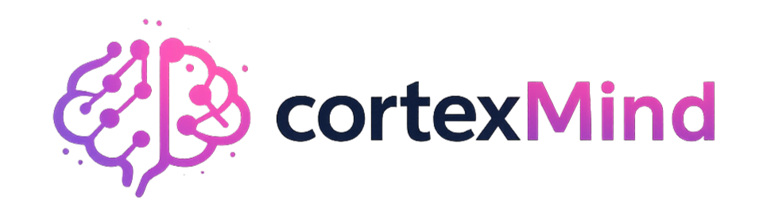

<p align="center">
  
</p>

<h1 align="center">CORTEX — The Shared Brain For AI Development</h1>

<p align="center"><strong>Git syncs code. CORTEX syncs understanding.</strong></p>

<p align="center">
  
  
  
  
  
</p>

---

CORTEX (a.k.a. **cortexMind**) is a **local-first AI development companion**. It scans your GitHub
repositories, builds a knowledge graph of each project (tech stack, authentication, features,
structure), generates a tailored **system prompt** per project, and exposes everything to your AI
coding tools over the **Model Context Protocol (MCP)** — so every agent, in every IDE, starts with
full project context and shared memory.

The whole system runs locally as a single Go daemon (`cortexd`) built on
[PocketBase](https://pocketbase.io), with a [SolidJS](https://www.solidjs.com) web UI. Your code,
memory, and tokens never leave your machine.

---

## Table of Contents

- [What It Does](#what-it-does)
- [Architecture](#architecture)
- [Technology Stack](#technology-stack)
- [Project Structure](#project-structure)
- [Prerequisites](#prerequisites)
- [Quick Start](#quick-start)
- [Running the Server](#running-the-server)
- [Running the UI](#running-the-ui)
- [Configuration](#configuration)
- [The Workflow](#the-workflow)
- [HTTP & MCP API](#http--mcp-api)
- [Supported AI Clients](#supported-ai-clients)
- [Troubleshooting](#troubleshooting)

---

## What It Does

1. **Scan GitHub repos** — Sign in with GitHub, then scan any repo. CORTEX clones it, indexes
   files/symbols, and analyzes the **tech stack, authentication approach, features, project
   structure, and API endpoints**, persisting a **knowledge graph** into local storage.
2. **Build a code graph** — Compile the indexed files into a persistent codebase-memory graph
   (directories, files, symbols, packages and their dependencies) that agents can query.
3. **Generate a system prompt** — For any scanned project, generate a project-specific agent
   "characterization" using Mistral or Ollama (with a heuristic fallback when no LLM is configured).
4. **Connect your AI tools via MCP** — Create a per-IDE authorized connection. The IDE loads the
   project characterization plus the memory of previous AI sessions, and writes new memory back as
   it works — tagged by which IDE/client and session produced it.
5. **Compress sessions into digests** — Roll a session's memories into a shareable summary
   (readable markdown + a compact agent-to-agent JSON) for fast hand-off to the next agent.
6. **Shared, persistent memory** — Whenever you return to a project (in any tool), the full
   accumulated memory is available, and can be exported to `.cortex/` and committed to the repo.

---

## Architecture

```
┌──────────────────────────┐         ┌──────────────────────────┐
│      SolidJS Web UI       │  HTTP   │       AI Clients          │
│   (Vite dev / embedded)   │◄──────► │  Cursor · VS Code · CLI · │
└────────────┬──────────────┘         │  Claude · Gemini · ...    │
             │ PocketBase REST          └────────────┬─────────────┘
             │ + ConnectRPC + /api/cortex             │ MCP (JSON-RPC 2.0 / HTTP)
             ▼                                         ▼
┌──────────────────────────────────────────────────────────────┐
│                      cortexd  (Go daemon)                      │
│                                                                │
│  PocketBase (SQLite + auth + REST + router)                    │
│  ├─ ConnectRPC services   (project, vault, task, search, ...)  │
│  ├─ /api/cortex/*         (scan, providers, prompt, graph,     │
│  │                         code-graph, digest, export, mcp)    │
│  └─ /mcp                  (MCP server, token-authorized)       │
│                                                                │
│  Subsystems:                                                   │
│   Scanner · Analyzer · Code Graph · Git Sync · Search ·        │
│   Vector/Embeddings · LLM (Mistral / Ollama) · File Watcher    │
└──────────────────────────────────────────────────────────────┘
```

Everything listens on `http://127.0.0.1:8090` by default.

---

## Technology Stack

### Backend (`cortexd`)
| Concern            | Technology |
|--------------------|------------|
| Language           | Go 1.25+ |
| App framework / DB | PocketBase (embedded SQLite, auth, REST, router) |
| RPC                | ConnectRPC (`connectrpc.com/connect`) |
| Config             | Viper (`cortex.yaml` + `CORTEX_*` env vars) |
| Logging            | Zerolog |
| Git                | go-git (clone, commit, pull) |
| File watching      | fsnotify |
| Code analysis      | Regex-based symbol / dependency / auth detection |
| LLM                | Mistral API, Ollama (chat + embeddings) |
| Vectors (optional) | Ollama embeddings + LanceDB sidecar |

### Frontend (`ui/`)
| Concern        | Technology |
|----------------|------------|
| Framework      | SolidJS + TypeScript |
| Build          | Vite |
| Routing        | `@solidjs/router` |
| Server state   | TanStack Query (`@tanstack/solid-query`) — keyed, cached, deduped queries + mutations |
| Client state   | Zustand (`zustand/vanilla` + `persist`, bridged into Solid) for UI preferences |
| Backend SDK    | `pocketbase` JS client + `fetch` to ConnectRPC / `/api/cortex` |
| Icons          | `lucide-solid` |

> **State management:** remote data lives in a single solid-query cache (`ui/src/api/queries.ts`),
> and device-level UI preferences (theme, layout, scan/export defaults) live in a persisted Zustand
> store (`ui/src/api/settings.ts`).

---

## Project Structure

```
Cortex/
├── cmd/
│   └── cortexd/
│       └── main.go                 # Daemon entrypoint (loads config, starts PocketBase)
│
├── internal/
│   ├── analyzer/                   # Deep project analysis
│   │   ├── analyzer.go             #   Orchestration + Analysis type, LLM enrichment
│   │   ├── detect.go               #   Dependency / auth / route signal detection
│   │   ├── manifest.go             #   package.json / go.mod / Cargo.toml / etc. parsing
│   │   ├── features.go             #   Feature inference from structure + signals
│   │   ├── graph.go                #   Knowledge-graph (nodes/edges) builder
│   │   └── codegraph.go            #   Codebase-memory graph builder
│   │
│   ├── api/                        # Higher-level JSON HTTP routes (/api/cortex/*)
│   │   ├── routes.go               #   Route registration
│   │   ├── scan.go                 #   Per-repo + bulk scan orchestration + persistence
│   │   ├── prompt.go               #   Per-project system-prompt generation
│   │   ├── providers.go            #   LLM/embedding provider config (per-user)
│   │   ├── codegraph.go            #   Build / fetch the code graph
│   │   ├── digest.go               #   Session digest generation + listing
│   │   ├── export.go               #   Portable .cortex/memory.json bundle export
│   │   ├── github.go               #   GitHub repo listing / import
│   │   └── mcp_admin.go            #   MCP connection (token) management
│   │
│   ├── auth/github.go              # GitHub OAuth hooks + REST client (list/clone repos)
│   ├── config/config.go            # cortex.yaml + env config loading
│   ├── daemon/daemon.go            # Wires PocketBase, RPC, /api/cortex, /mcp, watcher
│   │
│   ├── db/
│   │   ├── db.go                   # Activity logging helper
│   │   └── schema.go               # All PocketBase collections (created on boot)
│   │
│   ├── git/sync.go                 # Clone / commit / pull, .cortex/ directory mgmt
│   │
│   ├── llm/
│   │   ├── llm.go                  # ProviderConfig + Client interface + factory
│   │   ├── mistral.go              # Mistral chat + embeddings
│   │   └── ollama.go               # Ollama chat (prompt generation)
│   │
│   ├── mcp/                        # Model Context Protocol server
│   │   ├── server.go               #   JSON-RPC 2.0 handler + token auth + sessions
│   │   └── tools.go                #   Tools / prompts / resources implementations
│   │
│   ├── memory/vault.go             # Export vault entries to .cortex/ markdown files
│   │
│   ├── rpc/                        # ConnectRPC service handlers
│   │   ├── server.go  auth.go  convert.go
│   │   ├── project.go  task.go  vault.go  handoff.go
│   │   └── search.go  activity.go  daemon.go  user.go
│   │
│   ├── scanner/                    # Repository file indexer
│   │   ├── scanner.go              #   Walks repo, indexes files, writes scan_results
│   │   ├── symbols.go              #   Function/class/import extraction (regex)
│   │   └── language.go             #   Extension → language detection
│   │
│   ├── search/engine.go            # Keyword (FTS) search over collections
│   ├── vector/                     # Semantic-search abstraction (optional)
│   │   ├── store.go  ollama.go  lancedb.go
│   └── watcher/watcher.go          # fsnotify-based incremental re-scans
│
├── proto/cortex/v1/cortex.proto    # ConnectRPC service/message definitions
├── gen/                            # Generated Go code from proto (buf generate)
│
├── ui/                             # SolidJS web UI
│   ├── public/                     # logo.png, logowithname.png
│   ├── src/
│   │   ├── api/
│   │   │   ├── client.ts           # All backend calls (REST, ConnectRPC, /api/cortex)
│   │   │   ├── queries.ts          # TanStack Query hooks + keys + mutations (server state)
│   │   │   ├── queryClient.ts      # Shared QueryClient
│   │   │   ├── settings.ts         # Zustand store — UI preferences (client state)
│   │   │   ├── auth.tsx            # GitHub OAuth + session
│   │   │   └── pb.ts               # PocketBase client
│   │   ├── pages/
│   │   │   ├── Dashboard/  Projects/  Repository/  Vaults/  Tasks/  Handoffs/
│   │   │   ├── Search/  CodeGraph/  AgentMemory/  SessionDigests/
│   │   │   ├── AIContext/          # AI Agents / system-prompt builder
│   │   │   ├── MCPServer/          # MCP connections + per-platform integration guides
│   │   │   │   ├── MCPServer.tsx
│   │   │   │   └── integrations.ts # Per-client config catalog (Cursor, CLIs, IDEs...)
│   │   │   └── Settings/  Login/
│   │   ├── components/             # Sidebar, TopBar, Modal, ForceGraph, cards, feeds...
│   │   ├── layouts/  App.tsx  index.tsx  index.css
│   │   └── ...
│   └── package.json
│
├── cortex.yaml                     # Daemon configuration
├── buf.yaml / buf.gen.yaml         # Protobuf module + Go codegen config
├── setup.ps1                       # One-shot dependency setup (Windows)
├── go.mod / go.sum
└── README.md
```

### Key data collections (PocketBase, auto-created on boot)
| Collection        | Purpose |
|-------------------|---------|
| `users`           | GitHub-authenticated users (token, preferences / provider keys) |
| `projects`        | Repositories + analysis `metadata` (tech stack, graph, system prompt) |
| `scan_results`    | Per-scan summary (languages, modules, endpoints) |
| `file_index`      | Per-file index (symbols, checksums) |
| `code_graphs`     | Persistent codebase-memory graph (nodes / edges / stats) per project |
| `vault_entries`   | Architecture / decision / memory entries (exported to `.cortex/`) |
| `tasks`, `handoffs` | Project tasks and AI-to-AI handoffs |
| `agent_memories`  | AI working memory per project, tagged by IDE / session |
| `session_digests` | Compressed session summaries (markdown + compact JSON) |
| `activity_log`    | Audit / activity feed |
| `search_history`  | Recent search queries |
| `mcp_tokens`      | Per-IDE MCP connection credentials |

---

## Prerequisites

- **Go** 1.25+ — https://go.dev/dl/
- **Node.js** 18+ and npm — https://nodejs.org
- *(Optional)* **Ollama** for local embeddings/LLM — https://ollama.com
- *(Optional)* **Mistral API key** for cloud LLM enrichment — https://console.mistral.ai

---

## Quick Start

### Windows (one-shot setup)
```powershell
./setup.ps1
```
This runs `go mod tidy` and `npm install` in `ui/`.

### Manual setup (any OS)
```bash
# 1. Backend deps
go mod tidy

# 2. Frontend deps
cd ui && npm install && cd ..
```

---

## Running the Server

The daemon defaults to `serve` on `127.0.0.1:8090` when launched with no arguments.

```bash
# Run from source (development)
go run ./cmd/cortexd

# …or explicitly choose the address
go run ./cmd/cortexd serve --http 127.0.0.1:8090
```

Build a standalone binary:

```bash
# Windows
go build -o cortexd.exe ./cmd/cortexd
./cortexd.exe

# macOS / Linux
go build -o cortexd ./cmd/cortexd
./cortexd
```

Once running you have:

- **Web UI / REST API:** http://127.0.0.1:8090
- **PocketBase Admin:** http://127.0.0.1:8090/_/
- **MCP endpoint:** http://127.0.0.1:8090/mcp

### Create an admin (PocketBase superuser)

Needed to access the admin UI at `/_/` and configure GitHub OAuth:

```bash
go run ./cmd/cortexd superuser upsert admin@cortex.local "your-password"
```

---

## Running the UI

In development the UI runs on Vite and talks to the daemon on `:8090`.

```bash
cd ui
npm run dev          # Vite dev server (default http://localhost:5173)
```

> Run `cortexd` and the UI dev server in **two separate terminals**. Long-running dev
> servers should not be backgrounded by scripts.

Production build (type-check + bundle):

```bash
cd ui
npm run build        # tsc --noEmit + vite build → outputs static assets to ui/dist
```

---

## Configuration

Configuration is read from `cortex.yaml` (searched in `.`, `.cortex/`, and `~/.cortex/`) and
overridden by `CORTEX_*` environment variables. Missing config falls back to sensible defaults.

```yaml
server:
  port: 8090
  mcp_port: 8091
  data_dir: ~/.cortex/pb_data     # SQLite + cloned repos live here

scanner:
  interval_minutes: 30
  max_file_size_kb: 500
  ignored_dirs: [node_modules, .git, dist, build, target, __pycache__, .venv, vendor]
  ignored_extensions: [.lock, .sum, .min.js, .map]

search:
  enable_semantic: false          # true requires Ollama + a LanceDB sidecar
  ollama_url: "http://localhost:11434"
  embedding_model: "bge-m3"
  vector_db_url: "http://localhost:8123"

sync:
  auto_sync: true
  sync_on_push: true

env: development
log_level: info
```

### Secrets / environment variables
| Variable | Purpose |
|----------|---------|
| `CORTEX_GITHUB_CLIENT_ID`     | GitHub OAuth client id |
| `CORTEX_GITHUB_CLIENT_SECRET` | GitHub OAuth client secret |
| `CORTEX_OLLAMA_URL`           | Override Ollama URL |
| `CORTEX_DATA_DIR`             | Override data directory |

> GitHub OAuth is enabled/configured in the PocketBase admin UI (`/_/` → Settings → Auth providers).
> **LLM provider keys (Mistral) and embedding settings are configured per-user in the UI** under
> **Settings → AI Agents**, and stored on the user record — never in `cortex.yaml`.

---

## The Workflow

1. **Start** the daemon and UI, open the UI, and **sign in with GitHub**.
2. **Projects** page → your repos appear. Click **Scan** on a repo. CORTEX clones it, indexes it,
   and builds its knowledge graph.
3. **Code Graph** page → **Build graph** to compile the indexed files into a queryable
   codebase-memory graph.
4. *(Optional)* **Settings → AI Agents** → add a **Mistral key** or point at **Ollama** for richer
   output and memory embeddings.
5. **AI Agents** page → pick a scanned project → **Generate System Prompt**. This is the project's
   "characterization."
6. **Integrations (MCP Server)** page → **New Connection** → pick the project + your AI client →
   copy the generated, client-specific config into your IDE/CLI.
7. Work as usual. Your AI calls `cortex_get_context` to load the characterization + prior memory,
   `cortex_save_memory` to record progress/decisions, and `cortex_summarize_session` at the end to
   hand off. Next session — in any tool — picks up where you left off.

---

## HTTP & MCP API

### `/api/cortex/*` (JSON, Bearer = PocketBase token)
| Method & Path | Description |
|---------------|-------------|
| `POST /api/cortex/scan/{project}` | Clone (if needed), index and deeply analyze one project |
| `POST /api/cortex/system-prompt/{project}` | Generate the project's system prompt |
| `GET/POST /api/cortex/providers` | Get / set the per-user LLM + embedding config |
| `GET /api/cortex/knowledge-graph/{project}` | Stored knowledge graph for a project |
| `GET/POST /api/cortex/code-graph/{project}` | Fetch / build the codebase-memory graph |
| `POST /api/cortex/session-digest/{project}` | Compress a session's memories into a digest |
| `GET /api/cortex/session-digests/{project}` | List stored session digests |
| `POST /api/cortex/export/{project}` | Export a portable `.cortex/memory.json` bundle (`?push=true` to commit + push) |
| `GET /api/cortex/github/repos` | List the signed-in user's GitHub repos (paginated) |
| `POST /api/cortex/github/sync` | Import/sync GitHub repos as projects |
| `GET/POST /api/cortex/mcp/connections` | List / create MCP connections |
| `DELETE /api/cortex/mcp/connections/{id}` | Revoke a connection |
| `GET /api/cortex/mcp/connections/{id}/status` | Connection status (last used, connected) |

### `/mcp` (MCP, JSON-RPC 2.0 over HTTP, Bearer = MCP connection token)
**Tools:** `cortex_get_context` · `cortex_save_memory` · `cortex_list_memories` · `cortex_get_tasks` · `cortex_summarize_session`
**Prompts:** `project_characterization`
**Resources:** `cortex://project/characterization` · `cortex://project/memory`

---

## Supported AI Clients

The **Integrations (MCP Server)** page generates the correct config for each client:

- **AI Agent CLIs:** Claude Code, Codex, Gemini CLI, GitHub Copilot (`.vscode/mcp.json`), OpenCode
- **Web Clients:** Claude.ai, ChatGPT *(require a public HTTPS tunnel — localhost isn't reachable)*
- **IDEs:** Cursor, Antigravity, Kiro, Windsurf

Each connection is authorized by a unique Bearer token bound to a user + project + client.

---

## Troubleshooting

- **Port 8090 already in use** — another `cortexd` is running, or change `server.port` in `cortex.yaml`.
- **Can't open `/_/` admin** — create a superuser first (see [Running the Server](#running-the-server)).
- **GitHub repos don't appear** — ensure GitHub OAuth is configured in the admin UI and you signed in with the `repo` scope.
- **Scan says "no local path or GitHub URL"** — the project needs a `github_url`; re-sync via GitHub login, or scan a project that has one.
- **System prompt is "offline (no LLM)"** — configure a Mistral key or Ollama in **Settings → AI Agents**; otherwise a heuristic prompt is produced.
- **Web clients can't connect** — Claude.ai/ChatGPT need a public HTTPS URL; expose `/mcp` via a tunnel (e.g. cloudflared/ngrok).
- **MCP tool returns "not bound to a project"** — recreate the connection with a project selected.

---

<p align="center">
  <sub>CORTEX is local-first: your code, memory, and tokens stay on your machine in <code>~/.cortex/</code>.</sub>
</p>
<p align="center"><sub>Built with ❤️ by NexVed</sub></p>
